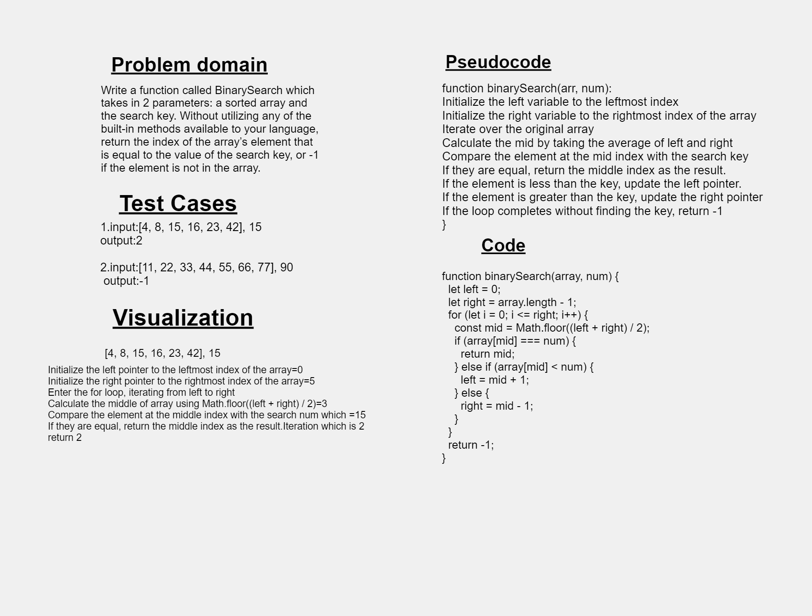

# Code Challenge: Class 02
##  insert Shift Array 
#### Summary :
the challenge is to Write a function called BinarySearch which takes in 2 parameters: a sorted array and the search key. Without utilizing any of the built-in methods available to your language, return the index of the array’s element that is equal to the value of the search key, or -1 if the element is not in the array.

### Description :
The function binarySearch takes two parameters: an array and a search num and two variables left and right, are initialized to represent the leftmost and rightmost indices of the search range within the array.
The for loop starts, iterating from the leftmost index to the rightmost index of the search range. Inside the loop, the variable mid is calculated as the middle index of the current search range using the formula (left + right) / 2 The element at the middle index is compared with the search key we have Scenarios illustrated by if statments
1. If they are equal, it means the search key has been found at the middle index, so we return the mid as the result.
2. If the element at the middle index is less than the search key, it means the search key lies in the right half of the remaining search range. So, we update the left pointer to mid + 1 to search in the right half.
3. If the element at the middle index is greater than the search key, it means the search key lies in the left half of the remaining search range. So, we update the right pointer to mid - 1 to search in the left half.
The loop continues until the left pointer becomes greater than the right pointer, indicating that the search range has been exhausted.
If the loop completes without finding the search key, we return -1.

### Whiteboard Process

### Approach & Efficiency
Approach: The algorithm compares the search key with the middle element of the current search range and adjusts the search range accordingly.
This process continues until the key is found or the search range is exhausted.
Efficiency: In each iteration of the for loop, the search range is halved, which reduces the search space by half so reduces the time complexity and the Space Complexity

### Solution
'use strict';
  
function binarySearch(array, num) {
  let left = 0;
  let right = array.length - 1;

  for (let i = 0; i <= right; i++) {
    const mid = Math.floor((left + right) / 2);

    if (array[mid] === num) {
      return mid;
    } else if (array[mid] < num) {
      left = mid + 1;
    } else {
      right = mid - 1;
    }
  }

  return -1;
}