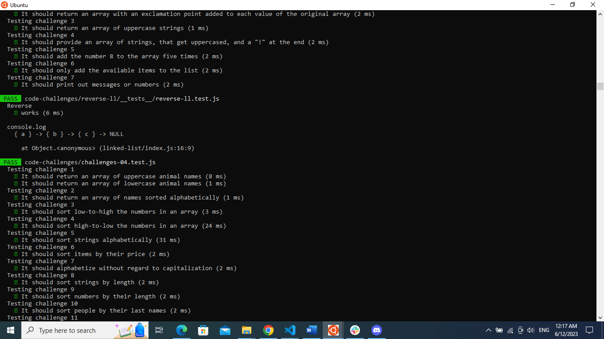
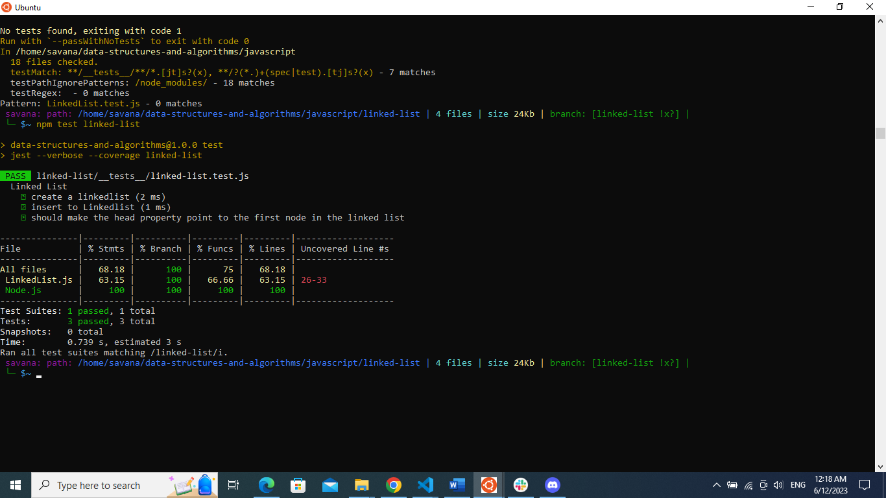

# Linked Lists:
### Description:
Create a Linked List class Within your Linked List class, include a head property.
Upon instantiation, an empty Linked List should be created.
The class should contain the following methods
* insert
Arguments: value
Returns: nothing
Adds a new node with that value to the head of the list with an O(1) Time performance.
* includes
Arguments: value
Returns: Boolean
Indicates whether that value exists as a Node’s value somewhere within the list.
* to string
Arguments: none
Returns: a string representing all the values in the Linked List, formatted as:
"{ a } -> { b } -> { c } -> NULL"

### Solution:
[Index.js ](javascript/linked-list/index.js)

[LinkedList.js ](javascript/linked-list/lib/LinkedList.js)

[Node.js](javascript/linked-list/lib/Node.js)

### test
[Test Code ](javascript/linked-list/__tests__/linked-list.test.js)

