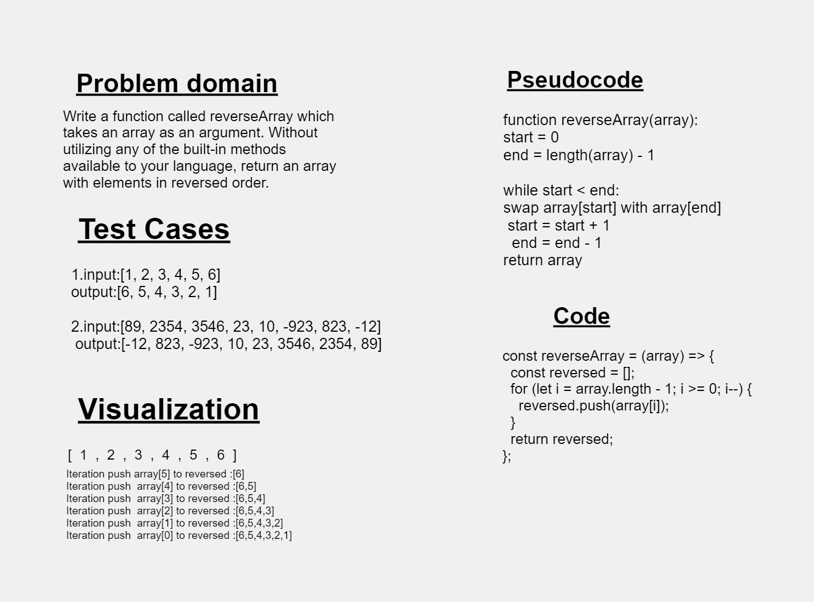

# Code Challenge: Class 01
## Array Reverse
#### Summary :
the challenge is to Write a function called reverseArray which takes an array as an argument. Without utilizing any of the built-in methods available to your language, return an array with elements in reversed order.

### Description :
Given an array, we want to reverse its order without using any built-in methods we will create a second array and a for loop. In each iteration, we retrieve the element at the current index from the original array and append it to the second array.

### Whiteboard Process

### Approach & Efficiency
we will defind an empty reversedarray to store the elements and use "forloop" over the original array from the last element to the first one and retrieved it to the reversedarray then return it.

### Solution
'use strict';
  
const reversedArray = (array) => {
    const reversed = [];
    for (let i = array.length - 1; i >= 0; i--) {
      reversed.push(array[i]);
    }
    return reversed;
  };
    
module.exports = reversedArray;