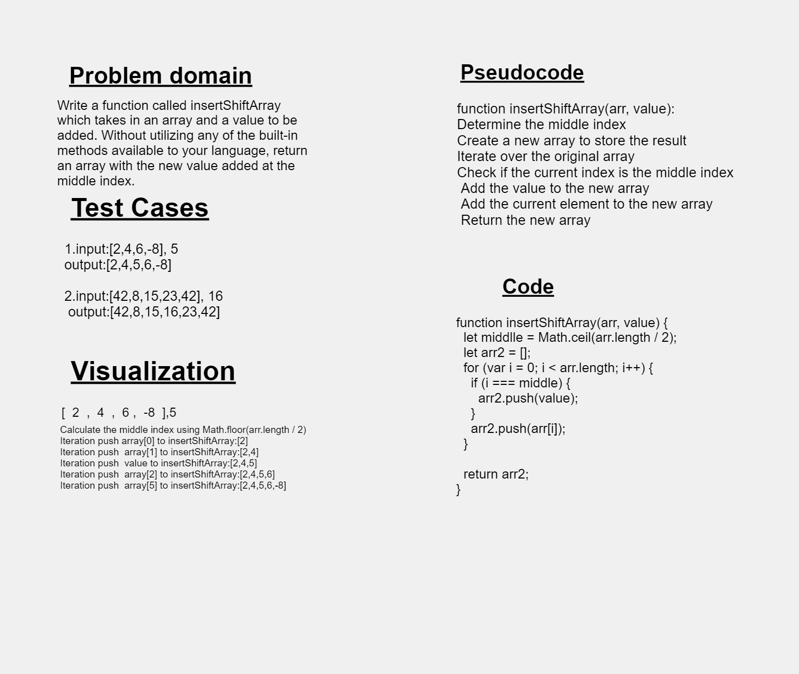

# Code Challenge: Class 02
##  insert Shift Array 
#### Summary :
the challenge is to Write a function called insertShiftArray which takes in an array and a value to be added. Without utilizing any of the built-in methods available to your language, return an array with the new value added at the middle index.

### Description :
Given an array and value we want to push this value in the middle of array without using any built-in methods we will create a second array and a for loop. In each iteration, we check if i equal array.length/2 and push the value in  certain index.

### Whiteboard Process

### Approach & Efficiency
we will defind middle varible and an empty arr2 to store the elements and use "forloop" over the original array from the first element to the end one and check if index=array.length/2 so in the middle of array then push the value then return new array which is arr2.

### Solution
'use strict';
  
function insertShiftArray(arr, value) {
  let middlle = Math.ceil(arr.length / 2);
  let arr2 = [];
  for (var i = 0; i < arr.length; i++) {
    if (i === middle) {
      arr2.push(value);
    }
    arr2.push(arr[i]);
  }

  return arr2;
}

    
module.exports = insertShiftArray;